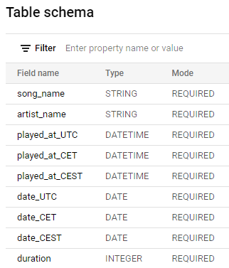

# My recent Spotify songs

### Tools used: GCP (BigQuery, Cloud Functions, Cloud Scheduler, Pub/Sub), pandas, [spotipy](https://spotipy.readthedocs.io/en/2.9.0/)

## DYI
* Create BigQuery dataset and table. Table schema should look like this   
* Create a Pub/Sub topic that will trigger the function
* Create a Cloud Function that subscribes to a Pub/Sub topic
* Add files to function source ([main.py](main.py), [requirements.txt](requirements.txt), [.cache](.cache))
* Create a Cloud Scheduler job that invokes the Pub/Sub trigger hourly
* Run the Cloud Scheduler job
## TO DO
* Analysis with Data Studio